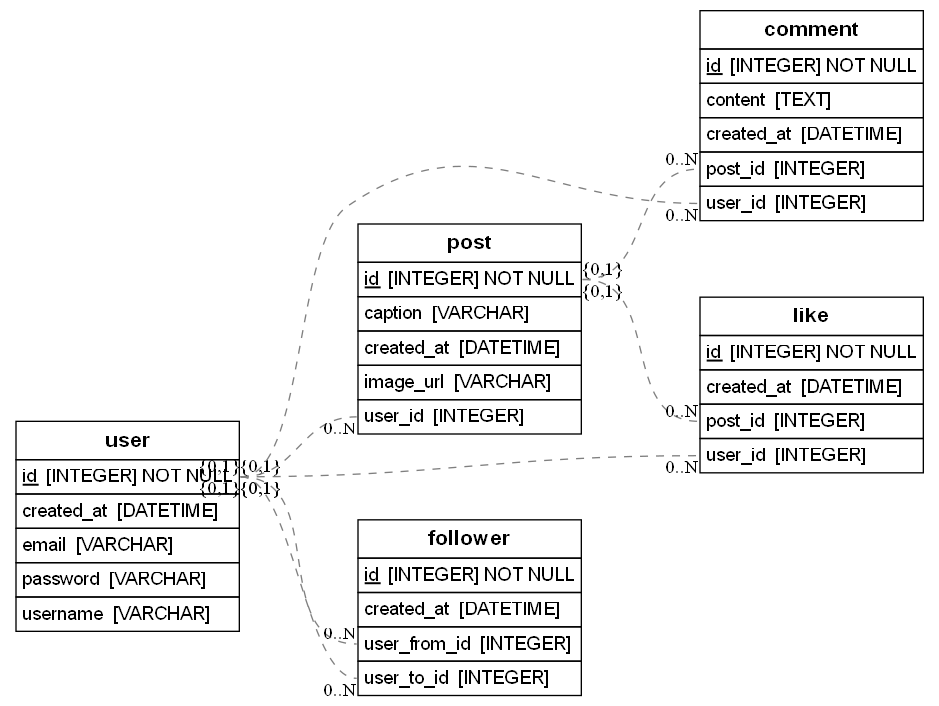
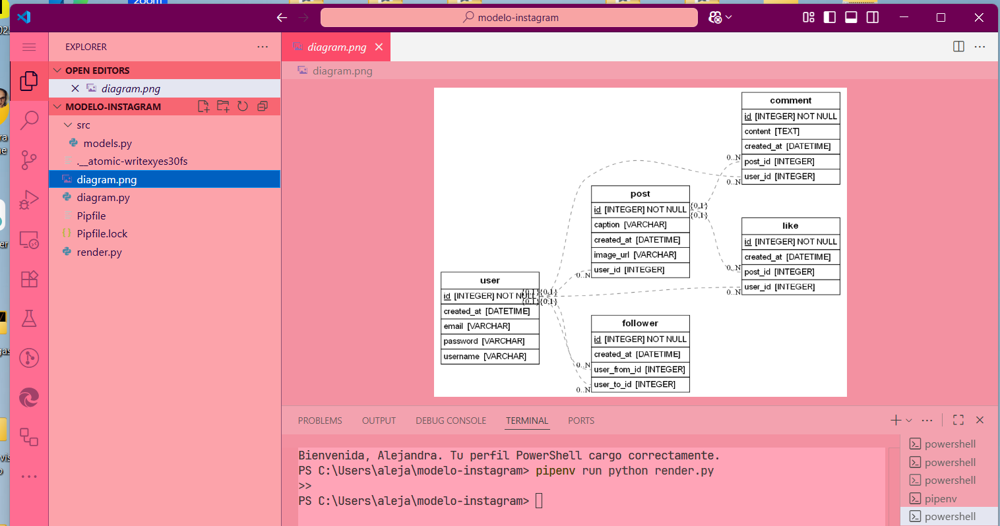

# ​ Modelo de Datos - Instagram

Este proyecto representa el modelo relacional de datos para una aplicación tipo Instagram, diseñado con **SQLAlchemy** y visualizado automáticamente como diagrama UML con **ERAlchemy** y **Graphviz**.

---

##  Arquitectura visual (Diagrama UML)

Diagrama generado automáticamente desde el código:  


Vista del entorno en VS Code mostrando el diagrama abierto:  


Visualización interactiva disponible aquí:  
🔗 https://dbdiagram.io/d/Instagram_Model-6893c8c7dd90d17865ca3356

---

##  Estructura del modelo

| Entidad   | Relación principal                                        |
|-----------|-----------------------------------------------------------|
| **User**  | Tiene `Post`, `Comment`, `Like`, y relaciones con seguidores (`Follower`). |
| **Post**  | Relacionado con `User`; puede tener muchos `Comment` y `Like`. |
| **Comment** | Relacionado con `Post` y `User`.                        |
| **Like**  | Relaciona `User` con `Post`.                              |
| **Follower** | Una relación entre dos usuarios (siguiendo / seguido). |

---

##  Tecnologías utilizadas

- Python 3  
- SQLAlchemy  
- ERAlchemy  
- pipenv  
- Graphviz

---

##  ¿Cómo ejecutar localmente?

```bash
git clone https://github.com/alejandrabarcena/flask-rest-hello.git
cd flask-rest-hello
pipenv install
pipenv shell
pipenv run python render.py

Este comando genera diagram.png en la raíz del proyecto.

Sobre el modelo
Este diseño forma parte de la capa de modelo en una arquitectura tipo MVC. Define cómo se almacenan y se relacionan los datos antes de crear las rutas, controladores o lógica de negocio. Gracias a este esquema, funcionalidades como comentar, dar like, seguir usuarios o mostrar posts pueden construirse con claridad y solidez.

Autor
Alejandra Bárcena
Bootcamp Full Stack Developer (Agosto 2025)


